Demo Stage 0 — Installing Helm and Preparing the Cluster

Step 1. Start the three-node kind cluster from Practical 1, using Listing 1 of the Practical 1 companion file (cluster/kind-cluster.yaml).
```bash 
kind create cluster --config cluster/kind-cluster.yaml
kubectl config current-context
kubectl get nodes
```
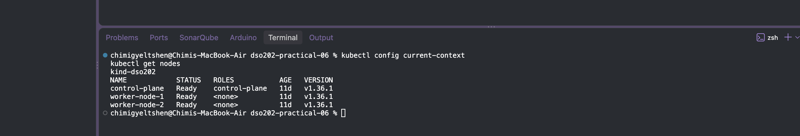

Step 2. Install Helm 4. The official installation page is

```bash 
brew install helm
```
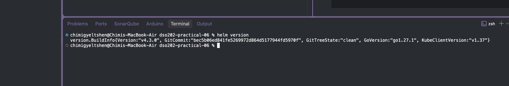

Step 4. Inspect where Helm stores its local configuration. Three paths matter:

- the repository list (HELM_REPOSITORY_CONFIG);
- the downloaded repository indexes (HELM_REPOSITORY_CACHE);
- the registry credentials (HELM_REGISTRY_CONFIG).

```bash 
helm env | grep -E 'HELM_(NAMESPACE|MAX_HISTORY|REPOSITORY_CONFIG|REPOSITORY_CACHE|REGISTRY_CONFIG)'
```
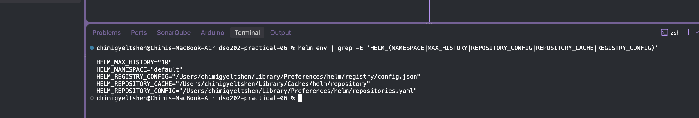

Step 5. Confirm that Helm can reach the cluster. No releases exist yet, so only the column headings are printed.

```bash 
helm list -A
```
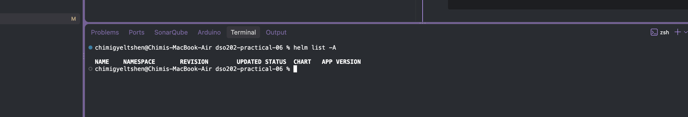

Step 6. Create the lab directory, which will be committed to version control.
```bash 
mkdir -p dso202-helm-lab/environments
cd dso202-helm-lab
```
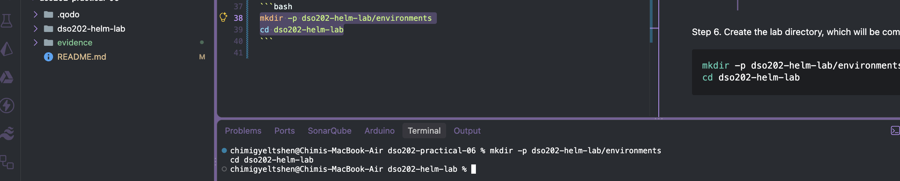

Demo Stage 1 — Consuming a Published Chart

Step 1. Register the HTTP chart repository under a local alias, then download its index.
```bash 
helm repo add podinfo https://stefanprodan.github.io/podinfo
helm repo update
```
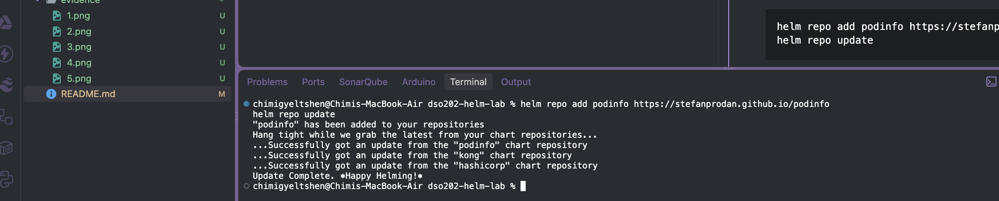

Step 2. Search the cached index.
```bash
helm search repo podinfo
helm search repo podinfo --versions | head -4
```
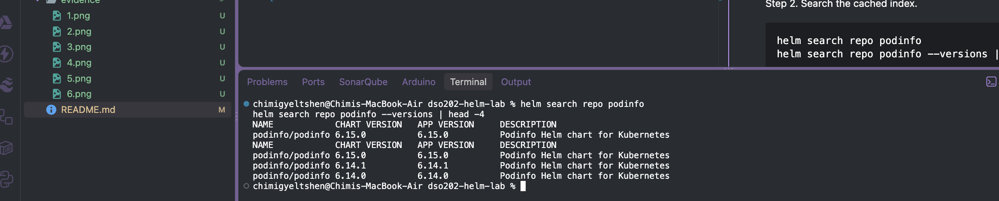

Step 3. Read the chart before installing it. Installing an unread chart means running unreviewed code with the installer's own cluster permissions.
```bash 
helm show chart podinfo/podinfo --version 6.15.0
helm show values podinfo/podinfo --version 6.15.0 | head -20
```
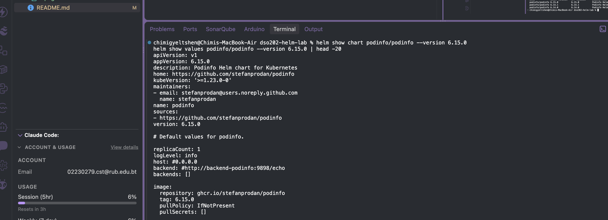

Installing and inspecting a release
Step 4. Install the chart as a release named my-podinfo, overriding two values.
```bash 
helm install my-podinfo podinfo/podinfo \
  --version 6.15.0 \
  --namespace dso202-helm --create-namespace \
  --set replicaCount=2 \
  --set ui.message="Hello from DSO202" \
  --wait --timeout 3m
```
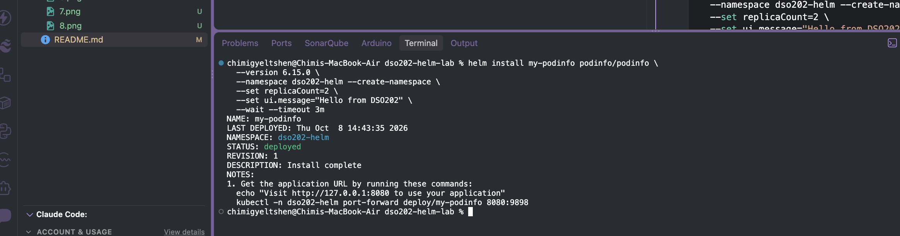

Step 5. List releases. The second command is run without -n and prints only headings, because the release is in dso202-helm and the current namespace is default.
```bash 
helm list -n dso202-helm
helm list
```
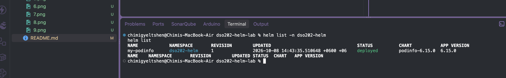

Step 6. Confirm the objects and reach the application. The Pod lines below show the expected state on the kind cluster; Pod name suffixes are random.
```bash 
kubectl get deploy,svc,pods -n dso202-helm
```
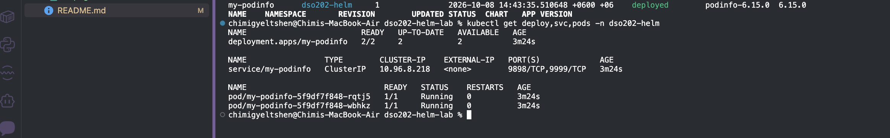

port formwarding for testing the application
```bash
kubectl -n dso202-helm port-forward deploy/my-podinfo 8080:9898
```
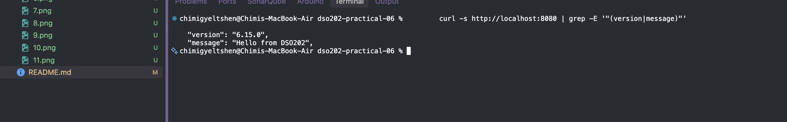

Step 7. Inspect the release. Each helm get subcommand reads the release record, not the live objects.
```bash 
helm status my-podinfo -n dso202-helm
helm get values my-podinfo -n dso202-helm
helm get values my-podinfo -n dso202-helm --all | head -5
helm get manifest my-podinfo -n dso202-helm | grep -E '^(# Source|kind:)'
```
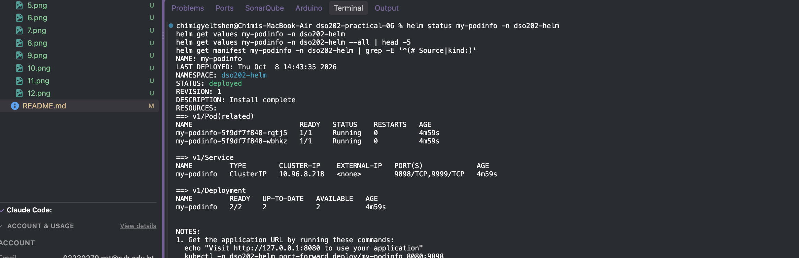

Step 8. Examine the release record. The Secret's labels allow a release's history to be found with a label selector.
```bash 
kubectl get secrets -n dso202-helm --show-labels
```
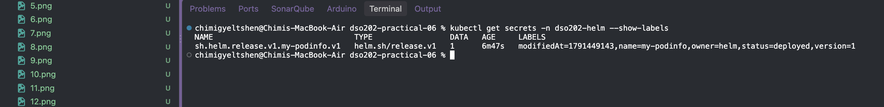

Upgrading: a failure demonstration
Step 9. Change the colour of the user interface. This command is deliberately incomplete: it supplies only the new value.
```bash 
helm upgrade my-podinfo podinfo/podinfo --version 6.15.0 -n dso202-helm \
  --set ui.color="#2e7d32"
helm get values my-podinfo -n dso202-helm
kubectl get deploy my-podinfo -n dso202-helm -o jsonpath='{.spec.replicas}{"\n"}'
```
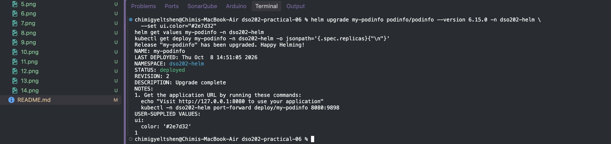

Step 10. Repeat the upgrade with --reuse-values and restore the original values. The previous user values are merged with the new ones.
```bash
helm upgrade my-podinfo podinfo/podinfo --version 6.15.0 -n dso202-helm \
  --reuse-values --set replicaCount=2 --set ui.message="Hello from DSO202"
helm get values my-podinfo -n dso202-helm
```
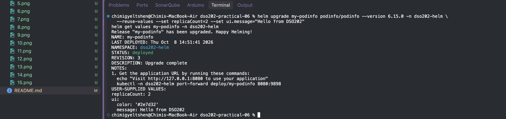

History and rollback
Step 11. Roll back to revision 1 and read the history.
```bash 
helm rollback my-podinfo 1 -n dso202-helm
helm history my-podinfo -n dso202-helm
helm get values my-podinfo -n dso202-helm
```
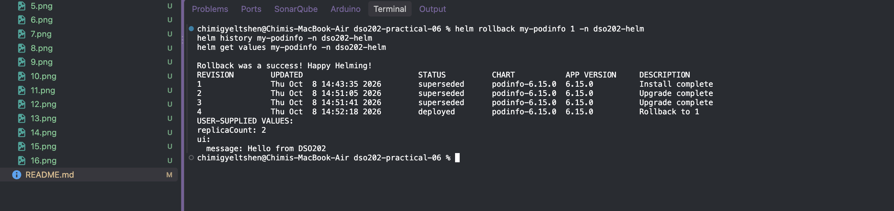


Uninstalling
Step 12. Remove the release.
```bash 
helm uninstall my-podinfo -n dso202-helm
kubectl get all,secrets -n dso202-helm
kubectl get namespace dso202-helm
```
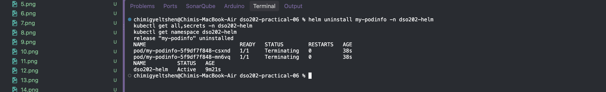

Chart Structure and Chart.yaml (Demo Stage 2)

Generating a scaffold
helm create generates a complete starting chart that follows the maintainers' conventions.
```bash 
helm create scaffold
find scaffold -type f | sort
```
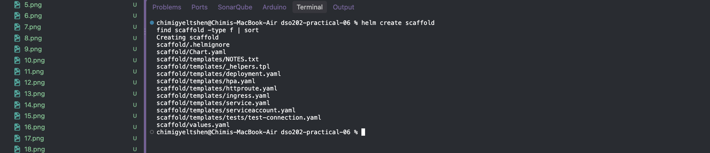

Steps: the chart skeleton
Step 1. Create the directories.
```bash 
mkdir -p webapp/templates/tests webapp/charts
```
Step 2. Create webapp/Chart.yaml.
Step 3. Create webapp/values.yaml.
Step 4. Create webapp/.helmignore.
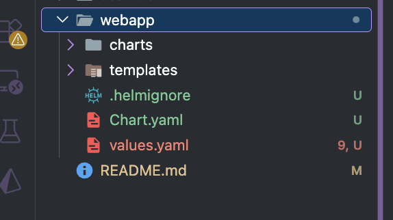


Demo Stage 3 — Writing the webapp Templates
Step 1. Create webapp/templates/_helpers.tpl.

Step 2. Create webapp/templates/configmap.yaml. The page content comes entirely from values and built-in objects.
Step 3. Create webapp/templates/deployment.yaml.
Step 4. Create webapp/templates/service.yaml. The nodePort field is emitted only when it makes sense.
Step 5. Create webapp/templates/NOTES.txt. NOTES are printed after install and upgrade, and should tell the operator how to reach the application.

Step 6. Create webapp/templates/tests/test-connection.yaml. It is explained in 3.2.4 and included now so that the chart is complete.

Step 7. Create the two environment files. They live outside the chart directory because they belong to the deployment of the chart, not to the chart itself.

# environments/dev.yaml - overrides for the development release.
```bash
replicaCount: 1
page:
  environment: dev
  message: "Development build - not for customers"
service:
  type: NodePort
  nodePort: 30080
```
# environments/prod.yaml - overrides for the production release.
```bash
replicaCount: 3
page:
  environment: prod
  message: "Production"
resources:
  requests:
    cpu: 100m
    memory: 64Mi
  limits:
    cpu: 500m
    memory: 128Mi
```


Step 8. Render the chart locally. helm template performs the rendering steps of helm install without contacting the cluster and prints the result.
```bash
helm template webapp-dev ./webapp -f environments/dev.yaml --namespace dso202-dev
```
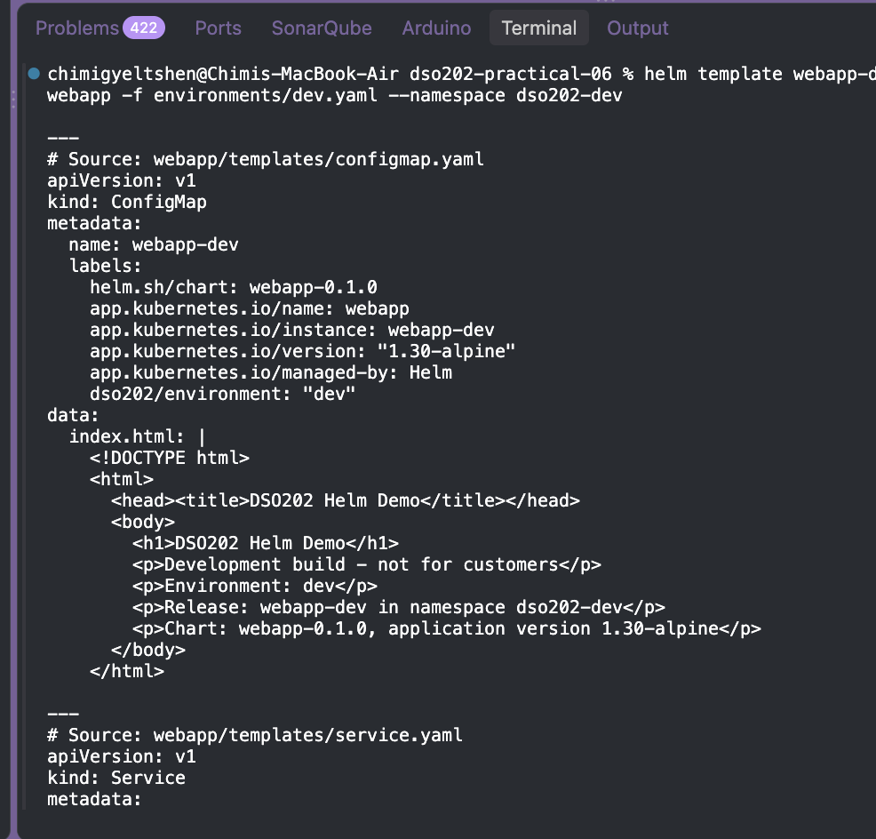

Values: Sources, Precedence and Merging (Demo Stage 4)

Steps
Step 1. Override one value from the command line on top of a file.
```bash 
helm template webapp-dev ./webapp -f environments/dev.yaml --set replicaCount=2 -s templates/deployment.yaml | grep 'replicas:'
```
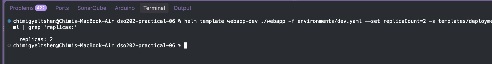

Step 2. Layer the two environment files in both orders and observe deep merging.
```bash 
helm template webapp-dev ./webapp -f environments/dev.yaml -f environments/prod.yaml -s templates/service.yaml | grep -E 'type:|nodePort'
helm template webapp-dev ./webapp -f environments/dev.yaml -f environments/prod.yaml -s templates/deployment.yaml | grep -E 'replicas:|environment'
```
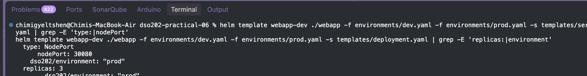

```bash
helm template webapp-dev ./webapp -f environments/prod.yaml -f environments/dev.yaml -s templates/deployment.yaml | grep -E 'replicas:|environment|cpu'
```
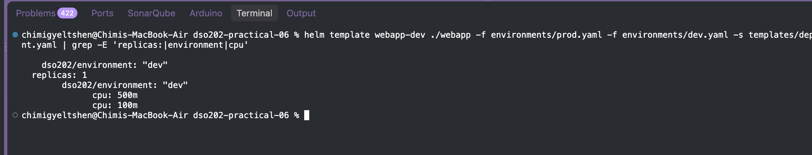

Step 3. Observe --set type conversion producing an invalid object. Annotation values must be strings.
```bash 
helm template webapp-dev ./webapp -f environments/dev.yaml -s templates/deployment.yaml \
  --set 'podAnnotations.prometheus\.io/scrape=true' | grep scrape
helm template webapp-dev ./webapp -f environments/dev.yaml -s templates/deployment.yaml \
  --set-string 'podAnnotations.prometheus\.io/scrape=true' | grep scrape
```
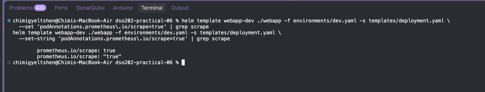

Step 4. Delete a default by setting it to null.
```bash 
helm template webapp-dev ./webapp -f environments/dev.yaml -s templates/deployment.yaml \
  --set resources.limits=null | sed -n '/resources:/,/volumeMounts/p'
```
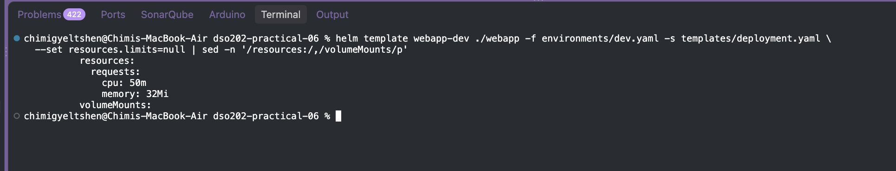

Validating Charts Before Installation (Demo Stage 5)


Steps: four failures and their fixes
Failure 1 — missing required value. Render without an environment file.
```bash 
helm template webapp-dev ./webapp
```
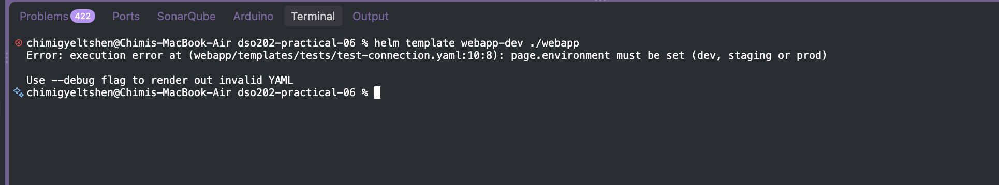

```bash 
helm lint ./webapp; echo "exit code: $?"
helm lint --strict ./webapp; echo "exit code: $?"
```
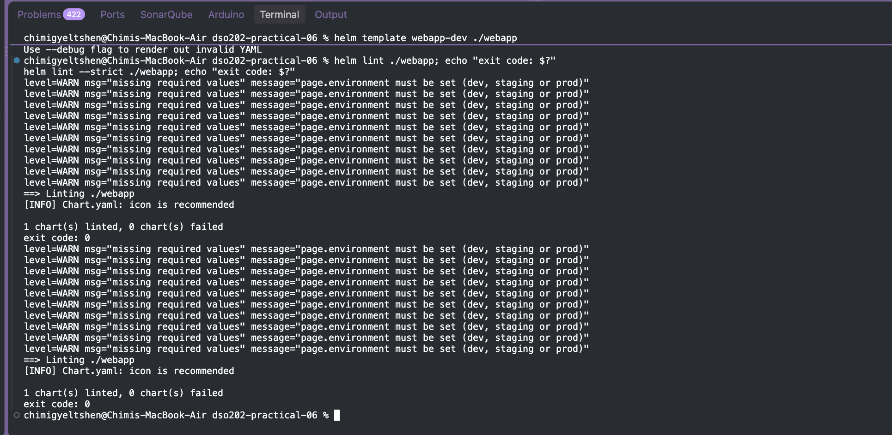
Step 5. Confirm the corrected chart passes every check for every environment.
```bash 
for env in dev prod; do
  helm lint ./webapp -f environments/$env.yaml &&
  helm template webapp-$env ./webapp -f environments/$env.yaml > /dev/null &&
  echo "$env: ok"
done
```
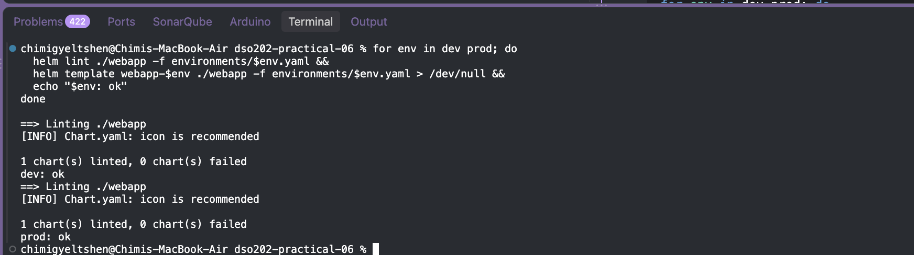


